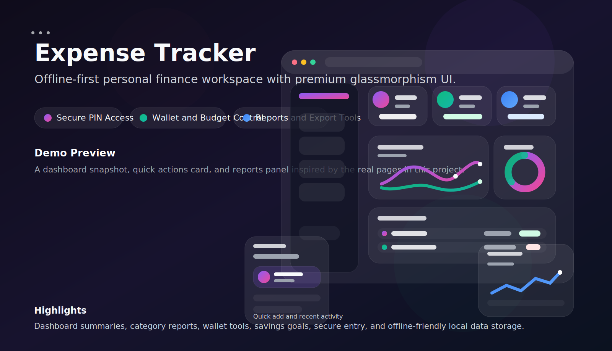
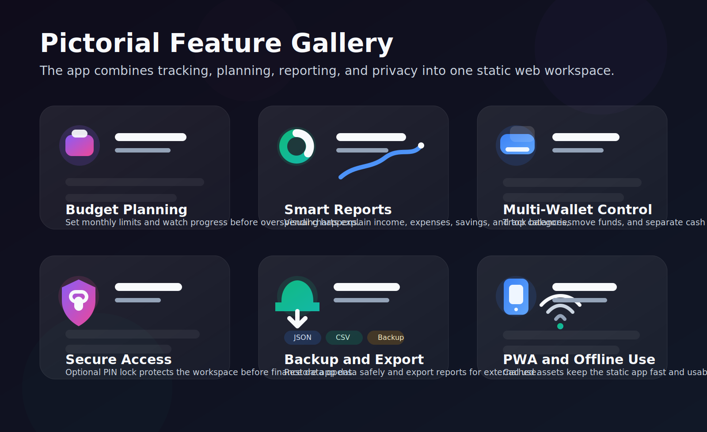
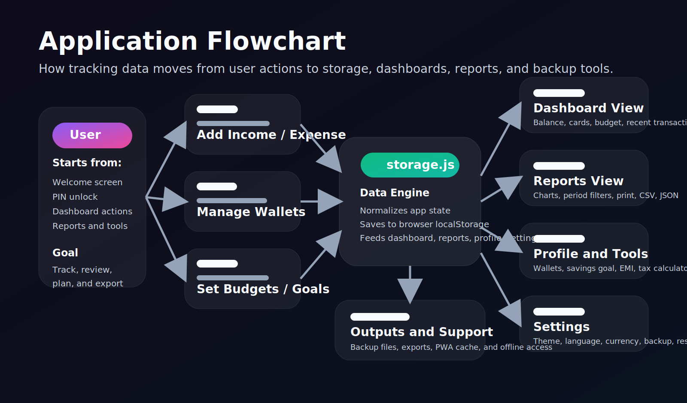

# Expense Tracker

<p>A modern offline-first expense tracking web app built with HTML, CSS, and vanilla JavaScript.</p>

<p><strong>Author:</strong> Aayush Sharma</p>

## Overview

Expense Tracker helps you manage:

- Income and expenses
- Category-wise budgets
- Wallet balances
- Savings goals
- Analytics and charts
- Backup and restore of app data
- PIN lock, theme, language, and currency settings

The app stores data directly in the browser using `localStorage`, so no backend or database setup is required.

## Demo Image

<p align="center">
  
</p>

## Pictorial Feature Image

<p align="center">
  
</p>

## Flowchart

<p align="center">
  
</p>

## Features

- Dashboard with balance, income, expense, and savings summary
- Recent transactions with search, filter, sort, and favorites
- Monthly budget tracking and category-wise budget limits
- Reports page with Chart.js visual analytics
- Wallet management with transfer support
- Savings goal tracking
- EMI and loan calculator
- Income tax calculator
- JSON backup and restore with CSV export
- PWA support with service worker caching
- Works mostly offline after assets are cached

## Tech Stack

- HTML5
- CSS3
- Vanilla JavaScript
- Chart.js
- Font Awesome
- Browser `localStorage`
- Service Worker and Web App Manifest

## Project Structure

| Path | Type | Purpose |
|---|---|---|
| `index.html` | Page | Welcome screen and secure entry flow |
| `dashboard.html` | Page | Main dashboard with balance cards, budget, and transactions |
| `reports.html` | Page | Analytics, charts, filters, and export views |
| `profile.html` | Page | Profile tools, wallets, savings goal, EMI, and tax calculator |
| `settings.html` | Page | Theme, language, currency, backup, and restore settings |
| `manifest.json` | Config | PWA manifest for installable app behavior |
| `sw.js` | Script | Service worker for caching and offline support |
| `css/global.css` | Stylesheet | Global theme, layout, variables, and responsive rules |
| `css/components.css` | Stylesheet | Reusable UI component styles |
| `css/pages.css` | Stylesheet | Page-specific styling |
| `assets/app-icon.svg` | Asset | App icon used by the PWA |
| `assets/default-avatar.svg` | Asset | Default profile avatar |
| `assets/readme-demo.svg` | Asset | README demo preview image |
| `assets/readme-features.svg` | Asset | README pictorial feature image |
| `assets/readme-flowchart.svg` | Asset | README application flowchart |
| `js/app.js` | Script | Shared app initialization and layout behavior |
| `js/storage.js` | Script | Browser `localStorage` data handling |
| `js/dashboard.js` | Script | Dashboard calculations and rendering |
| `js/report.js` | Script | Reports page logic and analytics updates |
| `js/settings.js` | Script | Settings page functionality |
| `js/wallet.js` | Script | Wallet creation, transfer, and balance handling |
| `js/budget.js` | Script | Budget tracking and limit management |
| `js/transaction.js` | Script | Transaction create, edit, delete, and listing logic |
| `js/chart.js` | Script | Chart.js graph rendering helpers |
| `js/export.js` | Script | CSV and JSON export features |
| `js/import.js` | Script | Backup import and restore logic |
| `js/filter.js` | Script | Filter utilities for reports and transactions |
| `js/search.js` | Script | Search support for transaction views |
| `js/theme.js` | Script | Theme switching and visual preference handling |

## How to Run

This project does not need `npm install` or any build step.

### Recommended: Run with a local server

Service Worker and PWA features work best when the app is served from `localhost`.

1. Open PowerShell in the project folder.
2. Run:

```powershell
python -m http.server 5500
```

3. Open this URL in your browser:

```text
http://127.0.0.1:5500/index.html
```

### Alternative: Open directly

You can also open `index.html` directly in the browser, but some features like service worker and PWA caching may not work properly on `file://`.

## First Use

- The app comes with sample data on first load
- Data is saved in your browser automatically
- PIN lock is disabled by default
- If you enable PIN lock and do not change the code, the default PIN is `1234`

## Data Storage

- App data is saved in browser `localStorage`
- Backup and restore options are available in `Settings`
- Clearing browser storage will remove saved app data

## Notes

- Internet may be needed on first load for CDN assets such as Chart.js, Font Awesome, Google Fonts, and app icons
- After the assets are cached, offline usage improves through the service worker
- If you want full offline support from the first load, move external CDN assets into local files
